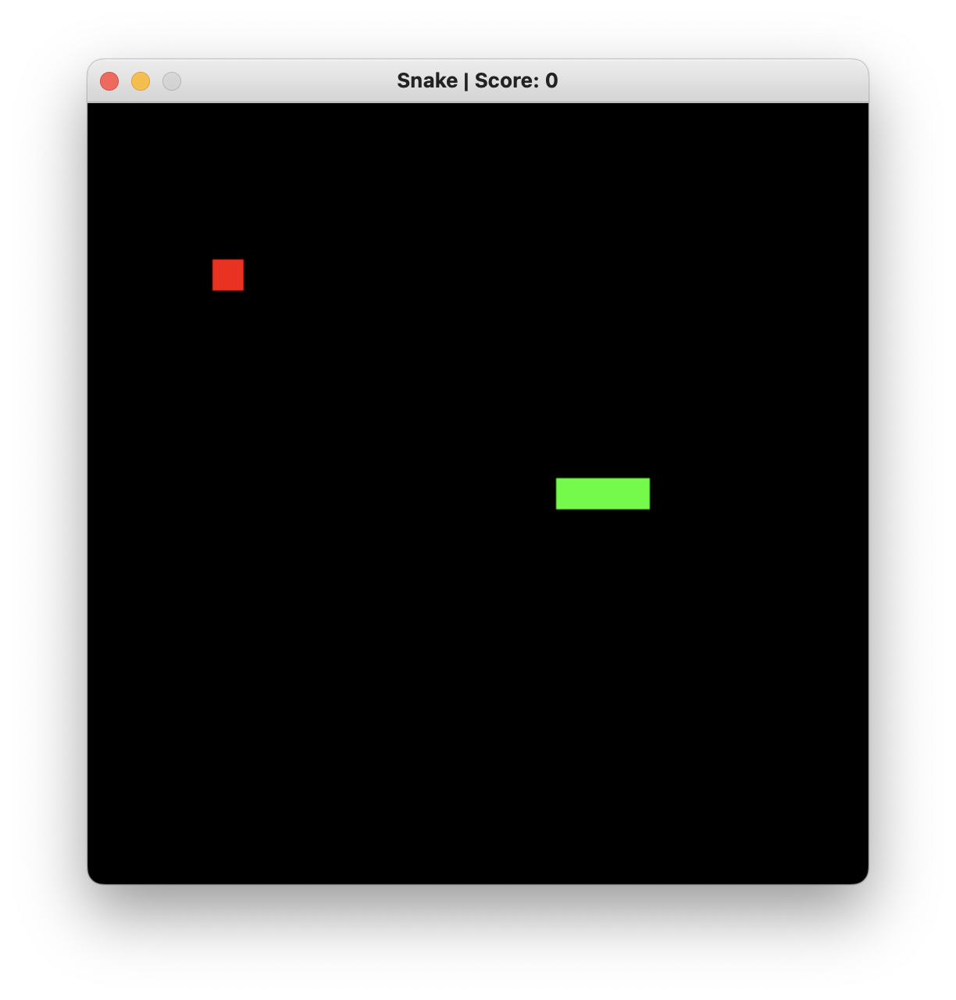
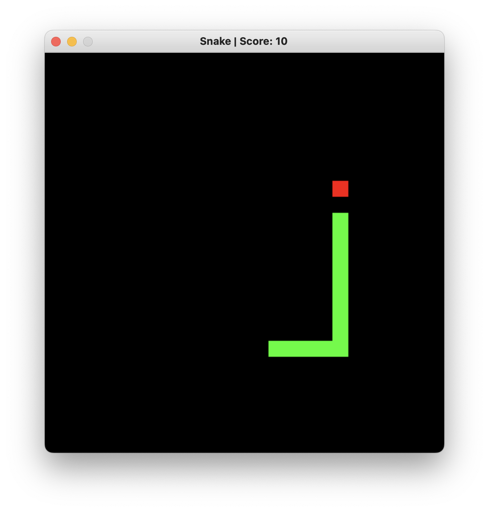
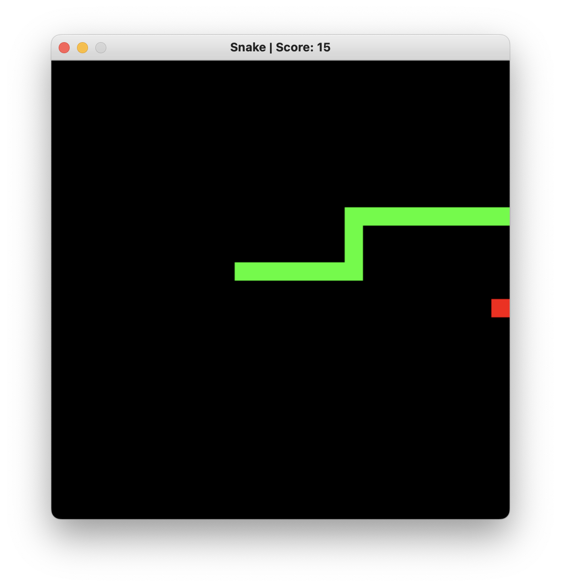
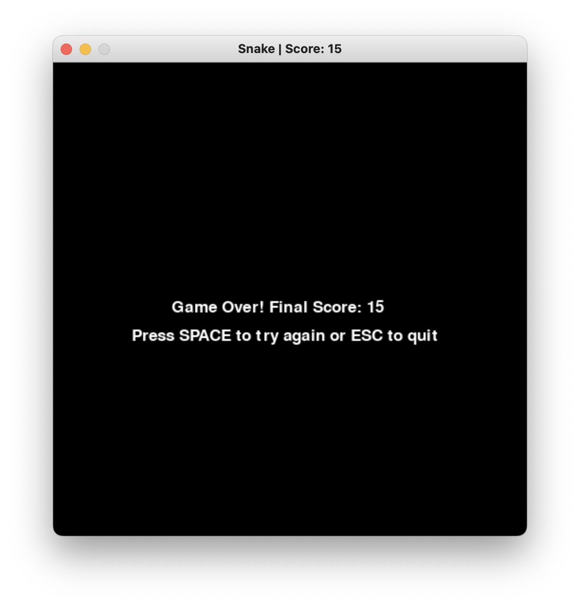

# Snake Game

A classic game implemented using Python and the Pygame library.

## Features

- **Classic Gameplay**: Navigate the snake to eat food and grow longer.
- **Dynamic Scoring**: Keep track of your score as you collect food.
- **Simple Controls**: Use the arrow keys to control the snake's movement.
- **Game Over Screen**: View your final score and options to restart or quit.

## Gameplay

1. **Objective**: Guide the snake to eat the red food blocks. Each food eaten increases your score and the length of the snake.
2. **Controls**:
   - **Up Arrow**: Move Up
   - **Down Arrow**: Move Down
   - **Left Arrow**: Move Left
   - **Right Arrow**: Move Right
3. **End Condition**: The game ends when the snake collides with the walls or itself. After a game over, you can choose to restart or exit.

## Code Overview

The project consists of a single Python file that utilizes:
- **Pygame**: For graphics and game mechanics.
- **Enum**: To manage directions.
- **Namedtuples**: For easy representation of points on the screen.

## Requirements

- Python 3.7
- Pygame

## Screenshots

Here are some screenshots of the game in action:

- The snake after spawning.

- The snake eating food.

- The snake colliding with the boundary.

- The game over screen.

